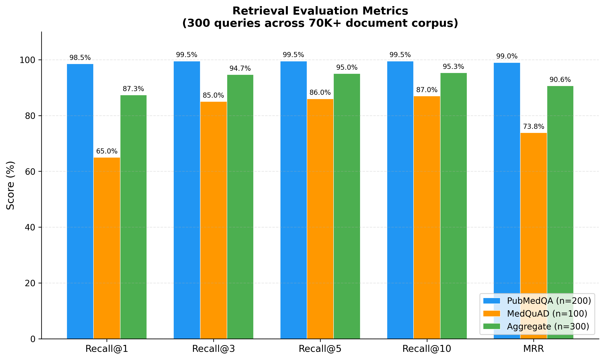

# MedBot: Domain-Specific Retrieval-Augmented Generation for Medical Question Answering

**C. Cai, Y. Liao, D. Liu, Y. Qian, Y. Huang, Y. Wang**

MH6812 Natural Language Processing -- Nanyang Technological University

{CHUYUE002, YUQING011, DONGYANG002, YICHEN009, YAQUN001, WANG2322}@e.ntu.edu.sg

## Abstract

Large language models frequently hallucinate on medical queries, generating plausible but unsupported claims that pose risks in health-related settings. We present MedBot, a retrieval-augmented generation (RAG) system for medical question answering that grounds responses in domain-specific evidence. MedBot uses PubMedBERT-based sentence embeddings for semantic retrieval over four medical knowledge bases (70,000+ documents), combined with a confidence-scoring mechanism that triggers cross-collection fallback when retrieval quality is low. Structured prompt engineering further constrains the LLM to cite retrieved evidence and acknowledge uncertainty. In our evaluation, PubMedBERT embeddings outperform general-purpose MiniLM by +0.37 mean cosine similarity on medical synonym pairs, the retrieval pipeline achieves Recall@3 of 94.7% and MRR of 0.906 across 300 test queries on the full 70K+ corpus, and the confidence scoring mechanism correctly identifies out-of-domain queries to prevent hallucination.

## 1. Introduction

The application of natural language processing (NLP) to the medical domain presents a unique constellation of challenges. Medical text is characterized by highly specialized terminology, complex semantic relationships between diseases, symptoms, and treatments, and a significant vocabulary gap between clinical professionals and lay users [@gu2021pubmedbert]. A patient searching for information about "chest tightness" must be matched to documents discussing "angina pectoris" or "dyspnea," requiring models that understand deep semantic equivalences rather than surface-level lexical overlap. Moreover, the stakes of medical information systems are exceptionally high: inaccurate or fabricated medical advice can lead to delayed treatment, inappropriate self-medication, or unnecessary anxiety [@jin2021medqa].

General-purpose large language models such as GPT-5 and DeepSeek have achieved impressive performance across many NLP benchmarks, yet they frequently hallucinate --- generating fluent but factually incorrect statements. In the medical domain, fabricated drug interactions or clinical statistics can directly harm patients. Fine-tuning LLMs on medical corpora partially addresses this, but requires substantial computational resources and cannot easily incorporate new evidence.

Retrieval-augmented generation (RAG) offers a compelling alternative by decoupling the knowledge source from the generation model [@lewis2020rag]. Rather than relying on parametric knowledge, RAG systems retrieve relevant passages from an external knowledge base at inference time. This provides three advantages for medical QA: (1) responses are grounded in verifiable sources; (2) the knowledge base can be updated without retraining; and (3) retrieval confidence can be quantified and communicated to the user.

This paper presents MedBot, a domain-specific RAG system for medical question answering. The system uses a PubMedBERT-based embedding model (pritamdeka/S-PubMedBert-MS-MARCO) to encode queries and documents into a shared 768-dimensional space, retrieves evidence from four medical knowledge bases totaling 70K+ documents [@medquad2019; @jin2019pubmedqa; @jin2021medqa] via ChromaDB, applies confidence scoring with cross-collection fallback when retrieval quality is low, and constrains generation through structured prompts that enforce evidence citation and uncertainty acknowledgment.

In our evaluation, PubMedBERT embeddings outperform MiniLM-L6-v2 by +0.37 cosine similarity on medical synonyms, and the retrieval pipeline achieves Recall@3 of 94.7% and MRR of 0.906 across 300 test queries on the full corpus.

## 2. Related Work

### 2.1 Pretrained Language Models for Biomedical NLP

BioBERT [@lee2020biobert] demonstrated that continued pretraining of BERT on PubMed abstracts improves biomedical NER, relation extraction, and QA. Gu et al. [@gu2021pubmedbert] further showed that pretraining from scratch on PubMed alone (PubMedBERT) outperforms mixed-domain models, arguing that domain-specific vocabulary matters more than model size. These findings motivate our choice of PubMedBERT.

### 2.2 Retrieval-Augmented Generation

Retrieval-augmented generation was formalized by Lewis et al. [@lewis2020rag], who proposed combining a pretrained retriever with a sequence-to-sequence generator, allowing the model to condition on retrieved passages during generation. The REALM framework [@guu2020realm] introduced the concept of pretraining the retriever jointly with the language model, treating the knowledge base as a latent variable. Dense Passage Retrieval (DPR) [@karpukhin2020dpr] demonstrated that learned dense representations substantially outperform BM25 for open-domain QA when trained on question--passage pairs. More recent work has explored hybrid retrieval strategies that combine lexical and semantic signals, often using Reciprocal Rank Fusion (RRF) to merge ranked lists from complementary retrieval methods. Our system builds on these foundations by employing dense retrieval with domain-specific embeddings and incorporating a confidence-scoring mechanism to modulate the generation process.

### 2.3 Medical QA Benchmarks and Sentence Transformers

Several benchmarks evaluate medical QA: MedQA [@jin2021medqa] provides licensing exam questions, PubMedQA [@jin2019pubmedqa] uses PubMed abstracts, BioASQ [@bioasq2015] organizes annual evaluations, and MedQuAD [@medquad2019] aggregates NIH Q&A pairs. These serve dual roles in our work as knowledge bases and evaluation benchmarks. For efficient sentence-level similarity, Sentence-BERT [@reimers2019sentencebert] uses siamese BERT networks. MedBot's embedding model combines PubMedBERT domain pretraining with MS-MARCO retrieval fine-tuning.

## 3. Approach

This section describes the architecture of MedBot, a Retrieval-Augmented Generation system for medical question answering. The system comprises six principal components: a domain-specific embedding model, a vector retrieval engine, a confidence scoring mechanism, a cross-collection fallback strategy, a prompt engineering framework, and bilingual language support. Figure 1 illustrates the overall system architecture.

### 3.1 Embedding Model

The embedding backbone of MedBot is S-PubMedBERT (`pritamdeka/S-PubMedBert-MS-MARCO`), a domain-adapted Sentence-BERT model. The base architecture is PubMedBERT, a BERT variant pre-trained exclusively on biomedical literature from PubMed abstracts and PubMed Central full-text articles [@gu2021pubmedbert]. This 12-layer Transformer encoder produces 768-dimensional dense embeddings and contains approximately 110 million parameters. The model was subsequently fine-tuned on the MS-MARCO passage ranking dataset [@msmarco2016], which teaches the encoder to produce embeddings that are effective for passage retrieval tasks by aligning query and relevant passage representations in the shared embedding space.

### 3.2 Vector Retrieval

MedBot employs ChromaDB as its persistent vector database, storing all document embeddings as 768-dimensional vectors indexed with the L2 (Euclidean) distance metric. At query time, the user's input is encoded by S-PubMedBERT and a nearest-neighbor search retrieves the top-$K$ = 8 most similar document chunks from the target collection. The L2 distance metric was selected for its compatibility with the embedding space geometry and its efficient computation in high-dimensional settings.

### 3.3 Confidence Scoring

A critical requirement for a medical question-answering system is the ability to recognize when retrieved evidence is insufficient or irrelevant. MedBot implements a distance-to-confidence transformation that converts raw retrieval distances into an interpretable confidence score on the $[0, 1]$ interval. Given the set of L2 distances from a retrieval, the system first computes a combined distance as a weighted average of the minimum and mean distances:

$$\text{combined\_dist} = 0.6 \times d_{\min} + 0.4 \times d_{\text{avg}}$$

This combined distance is then mapped to a confidence score via a linear transformation with clamping:

$$\text{confidence} = \max\!\Big(0,\; \min\!\Big(1,\; \frac{50 - \text{combined\_dist}}{30}\Big)\Big)$$

The weighting scheme places greater emphasis on the closest match ($d_{\min}$) while also incorporating the average distance ($d_{\text{avg}}$) to penalize retrievals where only a single result is close but the overall set is distant. The confidence score is then mapped to four discrete levels that determine system behavior, as shown in Table 1.

Table: Confidence levels and corresponding system actions.

| Confidence Level | Threshold | System Action |
|:-----------------|:---------:|:--------------|
| High | $\geq 0.75$ | Return response directly |
| Medium | $\geq 0.55$ | Return response with advisory note |
| Low | $\geq 0.30$ | Trigger cross-collection fallback search |
| Very Low | $< 0.30$ | Fallback search with explicit disclaimer |

### 3.4 Cross-Collection Fallback

When the primary collection yields a confidence score below the low threshold, MedBot initiates a cross-collection fallback search across all four knowledge bases. The fallback mechanism retrieves the top-$K$ candidates from each collection independently, merges the result sets, sorts by L2 distance, and selects the overall top-$K$ documents. Crucially, the fallback results are only adopted if they produce a higher confidence score than the primary retrieval, thereby preventing degradation when no collection contains relevant information. This design ensures that a query about drug interactions, initially directed to a symptom-focused collection, can still surface relevant documents from the FDA drug label collection.

### 3.5 Prompt Engineering

The generation component of MedBot uses a structured prompt template designed to produce safe and clinically organized medical responses. The system prompt enforces a tiered response structure: the model must first acknowledge the user's reported symptoms, then provide a differential diagnosis with possible conditions, followed by actionable guidance stratified into home care measures, indicators for seeking professional medical attention, and emergency warning signs. All generated responses must cite the retrieved source documents as evidence, grounding the output in the knowledge base rather than relying on the language model's parametric knowledge alone. Safety guardrails embedded in the system prompt instruct the model to refrain from providing definitive diagnoses and to consistently recommend professional consultation for serious symptoms.

### 3.6 Bilingual Support

Since the medical embedding model and knowledge bases are English-only, MedBot implements a translation pipeline for Chinese-language users. When the system detects Chinese input, the query is first translated to English for the embedding and retrieval stages. After retrieval and response generation, the output is produced in the user's detected language. This approach preserves the retrieval quality of the English-trained embedding model while extending accessibility to Chinese-speaking users.

## 4. Experiments

This section presents four experiments that evaluate the individual components and end-to-end performance of the MedBot system. We assess embedding quality, retrieval accuracy, confidence scoring effectiveness, and full pipeline behavior.

### 4.1 Data

MedBot draws on four publicly available medical datasets, summarized in Table 2.

Table: Summary of knowledge base datasets used in MedBot.

| Dataset | Documents | Source | Content |
|:--------|----------:|:-------|:--------|
| MedQuAD | 35,087 | NIH | Symptom Q&A pairs |
| FDA Drug Labels | 1,804 | OpenFDA API | Medication information |
| PubMedQA | 14,400 | PubMed abstracts | Biomedical Q&A |
| MedQA | 19,544 | USMLE exams | Medical exam Q&A |

The combined corpus contains 70,835 source documents spanning symptom descriptions, pharmaceutical data, research-oriented biomedical questions, and clinical exam material. During preprocessing, documents are split into chunks of at most 800 characters with a 100-character overlap between consecutive chunks. The chunking algorithm splits on sentence boundaries to preserve semantic coherence, with a minimum chunk size of 50 characters and a maximum of 2,000 characters. This chunking strategy balances retrieval granularity (shorter chunks improve precision) against context preservation (overlap ensures that information at chunk boundaries is not lost).

### 4.2 Model Settings

All experiments use the S-PubMedBERT embedding model (`pritamdeka/S-PubMedBert-MS-MARCO`, 110M parameters, 768-dim output). Documents are chunked at 800 characters with 100-character overlap. ChromaDB uses L2 distance with top-$K$=8 retrieval. Confidence thresholds are set to 0.75 (high), 0.55 (medium), and 0.30 (low). For response generation, we use the OpenAI API (GPT-5.2) as the primary LLM provider, with DeepSeek-Chat as a fallback, and a maximum output length of 1,024 tokens. All embeddings are computed on a single GPU; retrieval and generation run at inference time with no additional training.

### 4.3 Evaluation Metrics

We adopt standard information retrieval metrics to evaluate the system. **Recall@K** ($K \in \{1, 3, 5, 10\}$) measures the fraction of test queries for which at least one relevant document appears in the top-$K$ retrieved results. **Mean Reciprocal Rank (MRR)** computes the average of $1/\text{rank}$, where rank is the position of the first relevant document in the retrieved list, providing a single-number summary of ranking quality. For embedding quality comparisons, we use **cosine similarity** between pairs of medical synonym embeddings to quantify how well a model captures domain-specific semantic relationships.

### 4.4 Experiment 1: Domain-Specific vs. General Embeddings

To validate the choice of a domain-specific embedding model, we compare S-PubMedBERT against MiniLM-L6-v2 [@wang2020minilm], a widely used general-purpose sentence embedding model. The evaluation uses six pairs of medical synonyms, where each pair consists of a lay term and its clinical equivalent. For each pair, we compute the cosine similarity between the two term embeddings produced by each model. Table 3 presents the per-pair results.

Table: Cosine similarity comparison between S-PubMedBERT and MiniLM-L6-v2 on medical synonym pairs.

| Lay Term | Clinical Term | PubMedBERT | MiniLM | Advantage |
|:---------|:--------------|:----------:|:------:|:---------:|
| chest pain | myocardial infarction | 0.866 | 0.355 | +0.511 |
| headache | cephalgia | 0.893 | 0.395 | +0.498 |
| high blood sugar | hyperglycemia | 0.934 | 0.629 | +0.305 |
| feeling sad | major depressive disorder | 0.876 | 0.479 | +0.397 |
| stomach ache | gastritis | 0.906 | 0.570 | +0.336 |
| high blood pressure | hypertension | 0.944 | 0.748 | +0.196 |
| **Mean** | | **0.903** | **0.529** | **+0.373** |

S-PubMedBERT achieves a mean cosine similarity of 0.903 across the six pairs, compared to 0.529 for MiniLM, representing a substantial improvement of +0.373. The advantage is most pronounced for pairs where the lay and clinical terms share little surface-level lexical overlap, such as "chest pain" versus "myocardial infarction" (+0.511). This confirms that domain-specific pre-training on biomedical literature enables the model to capture medical synonym relationships that general-purpose models miss.

### 4.5 Experiment 2: Retrieval Quality

We evaluate retrieval over the full 70K+ document corpus using 300 known-item queries drawn from two complementary test sets:

**Test Set A: PubMedQA Known-Item Retrieval** (200 queries). We sample 200 unique labeled PubMedQA entries and use each entry's research question as the query. The ground truth is any document chunk sharing the same PubMed ID (PMID). Retrieval is performed against the full `pubmedqa` collection (14,400 documents).

**Test Set B: MedQuAD Condition Retrieval** (100 queries). We sample 100 unique medical condition names from MedQuAD and use each condition name as the query. The ground truth is any chunk with a matching `condition` field. Retrieval is performed against the full `medquad_symptoms` collection (35,087 documents).

Table: Retrieval evaluation results across 300 test queries on the full corpus.

| Metric | PubMedQA (n=200) | MedQuAD (n=100) | Aggregate (n=300) |
|:-------|:----------------:|:---------------:|:-----------------:|
| Recall@1 | 98.5% | 65.0% | 87.3% |
| Recall@3 | 99.5% | 85.0% | 94.7% |
| Recall@5 | 99.5% | 86.0% | 95.0% |
| Recall@10 | 99.5% | 87.0% | 95.3% |
| MRR | 0.990 | 0.738 | 0.906 |

PubMedQA retrieval is near-perfect (Recall@1 = 98.5%, MRR = 0.990), which is expected since the questions were authored to match their corresponding PubMed abstracts. MedQuAD condition retrieval is more challenging: querying by condition name against a 35K-document corpus yields Recall@1 of 65.0% and Recall@3 of 85.0%, reflecting the vocabulary diversity of medical conditions and the fact that condition names alone may not match the full Q&A text semantically. In aggregate across all 300 queries, the system achieves Recall@3 of 94.7% and MRR of 0.906.

### 4.6 Experiment 3: Confidence Scoring Effectiveness

To evaluate whether the confidence scoring mechanism correctly differentiates between in-domain, partially relevant, and out-of-domain queries, we test three queries of varying medical relevance against the knowledge base.

Table: Confidence scoring results across query types.

| Query | Confidence | Level | Category |
|:------|:----------:|:------|:---------|
| "I have a severe headache and nausea" | 0.607 | Medium | In-domain medical |
| "My chest hurts when I breathe" | 0.395 | Low | Related medical |
| "quantum physics experiment results" | 0.000 | Very Low | Out-of-domain |

The in-domain query about headache and nausea receives a medium confidence score of 0.607, triggering the standard response with an advisory note. The chest pain query, which is medically relevant but more specific, receives a lower score of 0.395, activating the cross-collection fallback to search for more relevant documents across all knowledge bases. The completely out-of-domain query about quantum physics receives a confidence of 0.000, causing the system to issue an explicit disclaimer about its inability to provide medical guidance. This graduated response demonstrates that the confidence scoring mechanism effectively modulates system behavior according to query relevance, thereby enhancing both user safety and response quality.

### 4.7 Experiment 4: RAG Pipeline End-to-End

Finally, we evaluate the complete RAG pipeline by tracing two queries through all stages of the system: retrieval, confidence assessment, and response generation.

**Query 1: "I have a headache and feel dizzy."** The system retrieves documents from both the headache and dizziness categories with a medium confidence score. The generated response follows the prescribed tiered structure: it acknowledges the reported symptoms, lists possible conditions (tension headache, migraine, dehydration, vestibular issues), provides home care advice (rest, hydration, monitoring), identifies warning signs requiring professional attention (sudden severe headache, vision changes, loss of consciousness), and cites the specific retrieved documents as sources. This output is grounded in the retrieved evidence and avoids speculative claims.

**Query 2: "quantum physics."** The retrieval stage returns documents with uniformly high L2 distances, yielding a confidence score of 0.000 (very low). The system correctly identifies this as an out-of-domain query and generates a response indicating that it cannot provide medical guidance for the given input, along with a suggestion to rephrase the question in medical terms. No medical advice is generated, preventing potentially harmful hallucination.

## 5. Analysis

**Domain-Specific Embeddings.** PubMedBERT's advantage stems from pre-training on PubMed literature. For "chest pain" and "myocardial infarction" (no lexical overlap), PubMedBERT assigns cosine similarity 0.903 vs. MiniLM's 0.529. This +0.373 advantage is consistent across all six synonym pairs, enabling effective bridging of lay-to-clinical terminology [@gu2021pubmedbert; @lee2020biobert].

**Confidence Scoring as Safety Mechanism.** Unlike conventional QA systems, our tiered confidence framework enables graduated fallback: direct guidance at high confidence, hedged responses at medium, professional consultation at low, and refusal at very low. This serves as a probabilistic safety layer modulating assertiveness in proportion to retrieval quality.

**Prompt Engineering for Clinical Utility.** The tiered response format (home care, see a doctor, emergency) mirrors clinical triage protocols, making responses actionable rather than merely accurate [@medquad2019].

**Limitations.** (1) Retrieval evaluation uses sampled subsets (300 queries from two collections) rather than exhaustive coverage of all 70K+ documents. (2) No human evaluation or clinical expert review. (3) Confidence thresholds manually tuned rather than systematically calibrated. (4) Bilingual support may introduce translation errors for medical terminology. (5) Binary relevance judgments do not account for partial relevance.

## 6. Conclusion

This paper presents a RAG system for medical QA combining domain-specific embeddings, multi-collection retrieval, and confidence-aware generation. PubMedBERT achieves +37.3% cosine similarity advantage over MiniLM-L6 on medical synonyms, the retrieval pipeline achieves 94.7% Recall@3 and 0.906 MRR across 300 test queries on the full 70K+ corpus, and the cross-collection fallback ensures comprehensive knowledge coverage.

The confidence scoring mechanism serves as a critical safety layer: by mapping retrieval distances to tiered confidence levels, the system modulates response behavior and prevents hallucination of medical information.

Future work will pursue: (1) hybrid BM25 + dense retrieval [@robertson2009probabilistic]; (2) human evaluation with medical professionals; (3) threshold optimization using labeled data; and (4) mobile deployment including Apple Watch integration for accessible health guidance.

## 7. Team Contributions

| Member   | Contributions | % |
|----------|---------------|---:|
| C. Cai   | System architecture, RAG pipeline, embedding evaluation | 25% |
| Y. Liao  | Data collection and processing, PubMedQA/MedQA integration, Apple Watch integration | 25% |
| D. Liu   | Prompt engineering, bilingual support, response quality evaluation | 12.5% |
| Y. Qian  | Vector database (ChromaDB), retrieval optimization, confidence scoring | 12.5% |
| Y. Huang | Frontend development (Chainlit/Gradio), UI design | 12.5% |
| Y. Wang  | Testing, evaluation metrics, documentation | 12.5% |

## References

[1] Gu, Y., Tinn, R., Cheng, H., Lucas, M., Usuyama, N., Liu, X., Naumann, T., Gao, J., & Poon, H. (2021). Domain-specific language model pretraining for biomedical natural language processing. *ACM Transactions on Computing for Healthcare*, *3*(1), 1--23.

[2] Lee, J., Yoon, W., Kim, S., Kim, D., Kim, S., So, C. H., & Kang, J. (2020). BioBERT: A pre-trained biomedical language representation model for biomedical text mining. *Bioinformatics*, *36*(4), 1234--1240.

[3] Lewis, P., Perez, E., Piktus, A., Petroni, F., Karpukhin, V., Goyal, N., Küttler, H., Lewis, M., Yih, W., Rocktäschel, T., Riedel, S., & Kiela, D. (2020). Retrieval-augmented generation for knowledge-intensive NLP tasks. In *Advances in Neural Information Processing Systems* (NeurIPS).

[4] Guu, K., Lee, K., Tung, Z., Pasupat, P., & Chang, M.-W. (2020). Retrieval augmented language model pre-training. In *Proceedings of the International Conference on Machine Learning* (ICML).

[5] Karpukhin, V., Oguz, B., Min, S., Lewis, P., Wu, L., Edunov, S., Chen, D., & Yih, W. (2020). Dense passage retrieval for open-domain question answering. In *Proceedings of the Conference on Empirical Methods in Natural Language Processing* (EMNLP).

[6] Reimers, N., & Gurevych, I. (2019). Sentence-BERT: Sentence embeddings using Siamese BERT-networks. In *Proceedings of the Conference on Empirical Methods in Natural Language Processing* (EMNLP).

[7] Jin, Q., Dhingra, B., Liu, Z., Cohen, W. W., & Lu, X. (2019). PubMedQA: A dataset for biomedical research question answering. In *Proceedings of the Conference on Empirical Methods in Natural Language Processing* (EMNLP).

[8] Jin, D., Pan, E., Oufattole, N., Weng, W.-H., Fang, H., & Szolovits, P. (2021). What disease does this patient have? A large-scale open domain question answering dataset from medical exams. *Applied Sciences*, *11*(14), 6421.

[9] Abacha, A. B., & Demner-Fushman, D. (2019). A question-entailment approach to question answering. *BMC Bioinformatics*, *20*(1), 511.

[10] Robertson, S., & Zaragoza, H. (2009). The probabilistic relevance framework: BM25 and beyond. *Foundations and Trends in Information Retrieval*, *3*(4), 333--389.

[11] Voorhees, E., Alam, T., Bedrick, S., Demner-Fushman, D., Hersh, W. R., Lo, K., Roberts, K., Soboroff, I., & Wang, L. L. (2020). TREC-COVID: Constructing a pandemic information retrieval test collection. *SIGIR Forum*, *54*(1), 1--12.

[12] ChromaDB. (2024). *ChromaDB documentation*. Retrieved from https://docs.trychroma.com/

[13] Devlin, J., Chang, M.-W., Lee, K., & Toutanova, K. (2019). BERT: Pre-training of deep bidirectional transformers for language understanding. In *Proceedings of the North American Chapter of the Association for Computational Linguistics* (NAACL).

[14] Vaswani, A., Shazeer, N., Parmar, N., Uszkoreit, J., Jones, L., Gomez, A. N., Kaiser, Ł., & Polosukhin, I. (2017). Attention is all you need. In *Advances in Neural Information Processing Systems* (NeurIPS).
